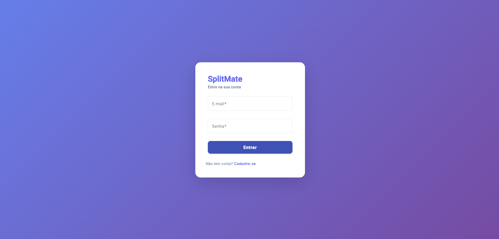
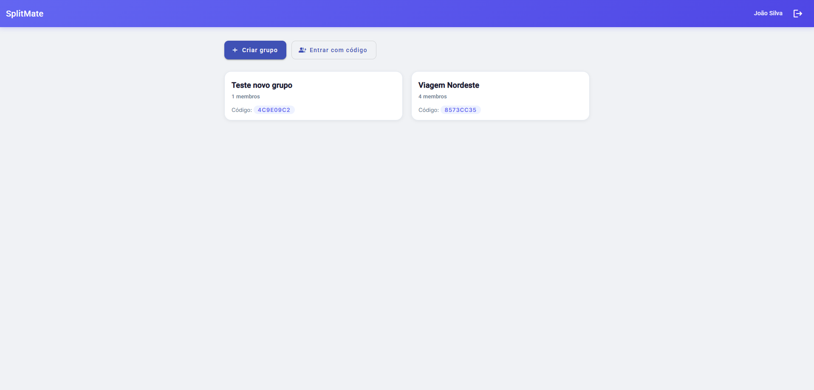

# SplitMate

Aplicação web para dividir despesas em grupo — viagens, repúblicas, casais ou qualquer situação onde várias pessoas compartilham gastos. O sistema calcula automaticamente quem deve pagar quem, minimizando o número de transferências necessárias para zerar as dívidas do grupo.

> Projeto desenvolvido com foco em boas práticas, Clean Architecture e Clean Code, como parte do meu portfólio de desenvolvimento.

## Demonstração

| Login | Meus grupos |
|---|---|
|  |  |

**Detalhe do grupo — gastos e cálculo de dívidas:**


## Funcionalidades

- Cadastro e login com autenticação JWT (access token + refresh token)
- Criação de grupos com código de convite único
- Entrada em grupos existentes via código
- Registro de gastos com divisão entre membros (igual ou personalizada)
- Cálculo automático de dívidas — algoritmo que minimiza o número de transferências necessárias
- Autorização por grupo: cada usuário só acessa os grupos dos quais participa

## Tecnologias

**Backend**
- .NET 9 / ASP.NET Core Web API
- Entity Framework Core + SQLite
- JWT Bearer Authentication
- BCrypt para hash de senhas
- xUnit + Moq para testes unitários
- Swagger / Swashbuckle

**Frontend**
- Angular 21 (standalone components)
- Angular Material
- Reactive Forms
- RxJS

## Arquitetura

O backend segue **Clean Architecture**, organizado em quatro camadas com dependências unidirecionais (de fora para dentro):

```
SplitMate.API            → Controllers, configuração HTTP, Swagger
SplitMate.Application    → Use Cases, DTOs, interfaces (contratos)
SplitMate.Domain         → Entidades, regras de negócio, DebtCalculator
SplitMate.Infrastructure → EF Core, repositórios, JWT, implementações
```

A camada `Domain` não possui nenhuma dependência externa — é puro C#. A camada `Application` define interfaces que a `Infrastructure` implementa, seguindo o princípio de inversão de dependência (SOLID).

### Destaque: `DebtCalculator`

O núcleo do sistema é um domain service que recebe a lista de gastos de um grupo e devolve o número mínimo de transferências necessárias para zerar todas as dívidas, usando uma estratégia de emparelhamento entre maiores credores e devedores. É a parte do projeto com testes unitários mais completos.

## Estrutura do projeto

```
SplitMate/
├── SplitMate.API/              # Web API — controllers e configuração
├── SplitMate.Application/      # Use cases, DTOs, interfaces
├── SplitMate.Domain/           # Entidades e regras de negócio
├── SplitMate.Infrastructure/   # EF Core, repositórios, serviços
├── SplitMate.Tests/            # Testes unitários (xUnit + Moq)
└── splitmate-web/              # Frontend Angular
```

## Como rodar o projeto

### Pré-requisitos

- [.NET 9 SDK](https://dotnet.microsoft.com/download/dotnet/9.0)
- [Node.js 18+](https://nodejs.org/)
- [Angular CLI](https://angular.dev/installation) (`npm install -g @angular/cli`)

### Backend

```bash
# na raiz do projeto
dotnet restore
dotnet ef database update -p SplitMate.Infrastructure -s SplitMate.API
dotnet run --project SplitMate.API
```

A API estará disponível em `http://localhost:5125` e o Swagger em `http://localhost:5125/swagger`.

### Frontend

```bash
cd splitmate-web
npm install
ng serve
```

A aplicação estará disponível em `http://localhost:4200`.

### Rodando os testes

```bash
dotnet test
```

## Autenticação

A API utiliza JWT para autenticação:

1. O usuário se registra ou faz login e recebe um `accessToken` (válido por 60 minutos) e um `refreshToken` (válido por 7 dias)
2. O `accessToken` é enviado no header `Authorization: Bearer {token}` em todas as requisições autenticadas
3. As configurações de expiração estão centralizadas em `appsettings.json`, na seção `JwtSettings`

## Principais decisões técnicas

- **DTOs em todas as camadas de entrada/saída** — as entidades de domínio nunca são expostas diretamente pela API, evitando vazamento de dados internos (como hash de senha) e desacoplando o contrato da API do modelo de domínio
- **Factory methods nas entidades** (`User.Create()`, `Expense.Create()`) — construtores protegidos garantem que toda entidade nasce em um estado válido, com as regras de negócio aplicadas desde a criação
- **Repository Pattern** — toda a lógica de acesso a dados está isolada na camada de Infrastructure, permitindo trocar o banco de dados sem impactar use cases ou regras de negócio
- **SQLite em desenvolvimento** — escolhido para facilitar a execução local sem necessidade de instalar um SGBD; a troca para PostgreSQL ou SQL Server em produção exige apenas alterar a connection string e o provider do EF Core

## Possíveis melhorias futuras

- [ ] Renovação automática de access token via refresh token no frontend
- [ ] Edição e remoção de gastos e grupos
- [ ] Testes unitários para os demais use cases
- [ ] Deploy do backend e frontend
- [ ] Notificações quando um novo gasto é adicionado ao grupo

## Autor

Desenvolvido por **Rahul** como projeto de portfólio.

[LinkedIn](#) · [GitHub](#)
